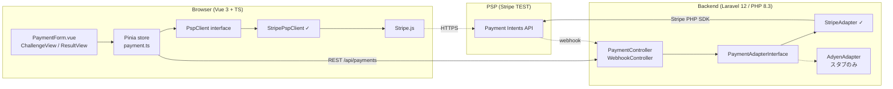
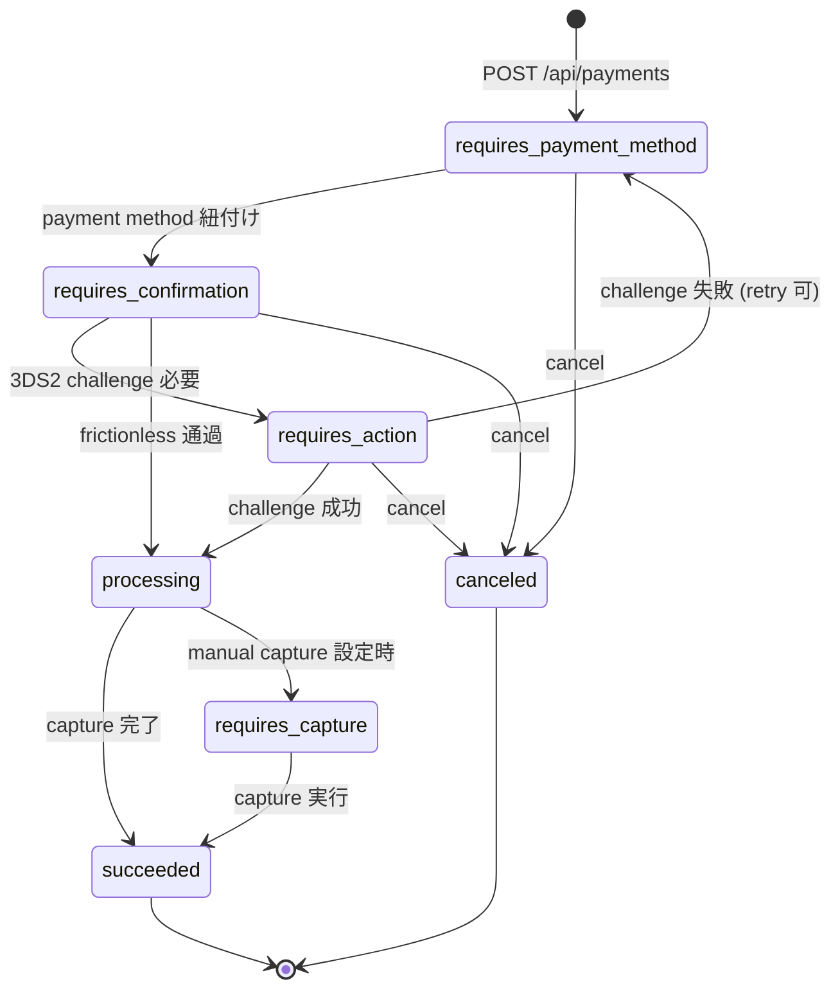
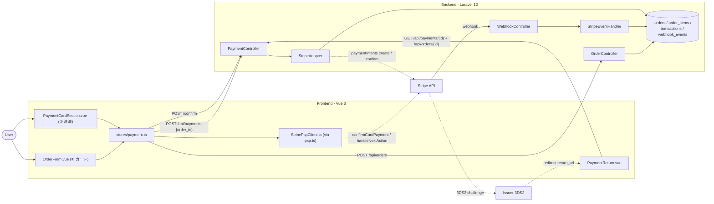
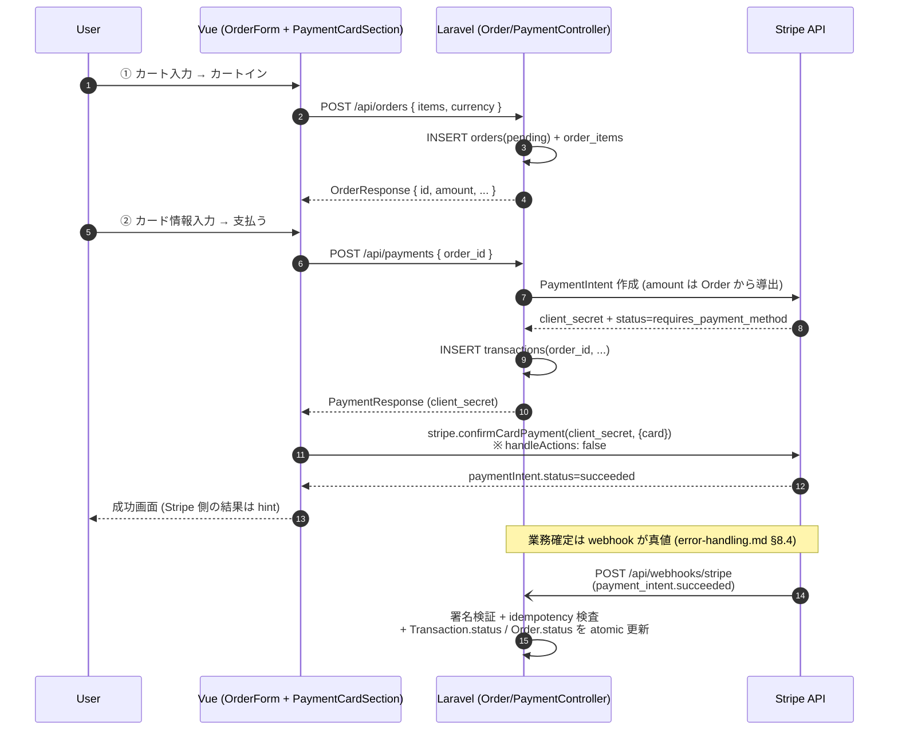
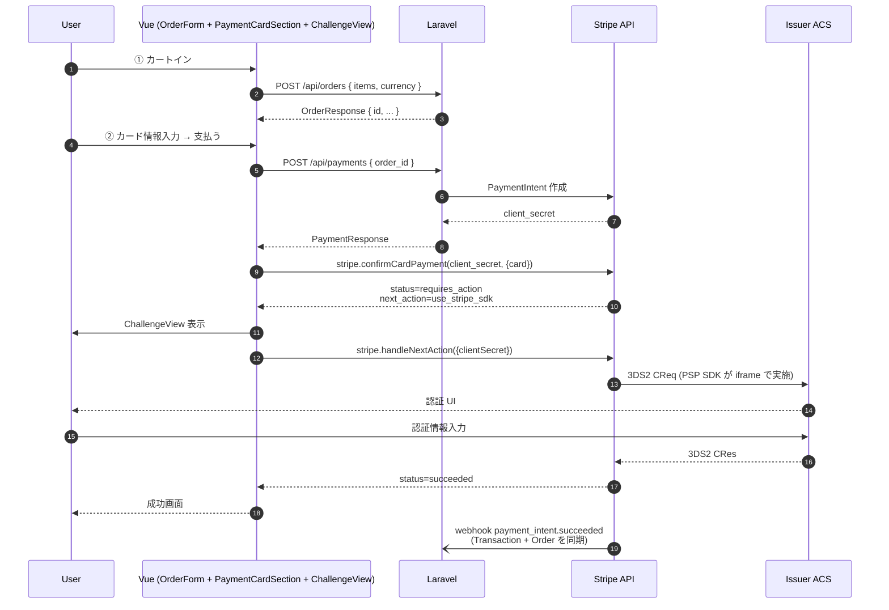
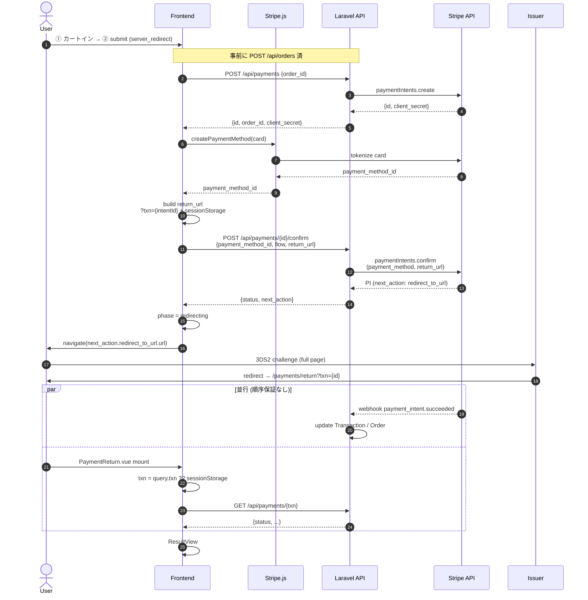
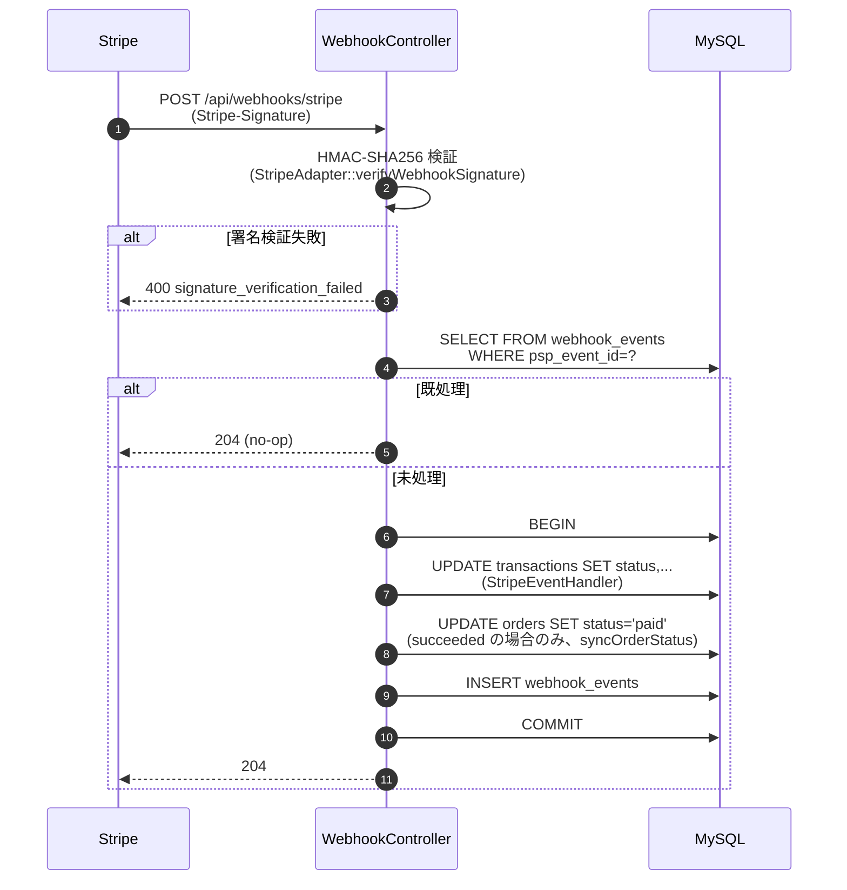
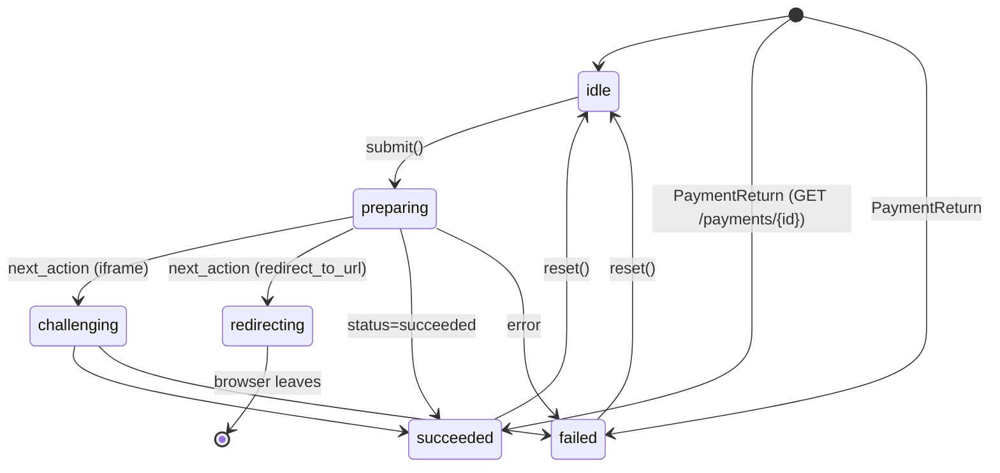
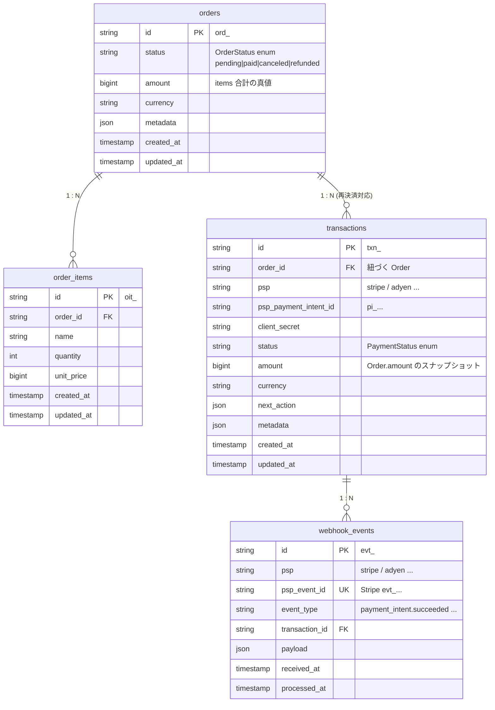

# Architecture

3ds2-demo のシステム構成と設計思想を記述する。実装の細部はソースコードを参照すること。本ドキュメントは「**なぜ**この構造か」と「**何を**抽象化したか」を残すことを目的とする。

---

## 1. レイヤー構造



### キー設計判断

| 判断 | 理由 |
|---|---|
| **frontend / backend を別プロセス** (monorepo) | 学習デモとして「実 SaaS 構成」に近づけ、Adyen 等別 SDK 構成へ差し替えるイメージを持たせる |
| **API contract 駆動** ([docs/api-contract.yaml](api-contract.yaml)) | frontend ↔ backend の境界を OpenAPI で固定化し、backend 実装が言語別実装に差し替わっても frontend 不変 |
| **両層 Adapter** (backend は実装済、frontend は未) | PSP 統合形態（Direct API / Hosted / iframe / JS Module）をいずれも吸収できる対称構造 |
| **Stripe Advanced flow** （Sessions ではなく Payment Intents 直接制御） | 3DS2 challenge 経路 (`use_stripe_sdk` / `redirect_to_url`) を明示的にハンドリングし、仕様理解を可視化する |

---

## 2. Adapter パターン

### 2.1 backend Adapter（実装済）

`PaymentAdapterInterface` が backend ↔ PSP API の境界を抽象化する。

```
app/Adapters/
├── PaymentAdapterInterface.php   # 共通 interface
├── StripeAdapter.php             # 実装（createPayment / confirmPayment / getPayment / verifyWebhookSignature）
└── AdyenAdapter.php              # スタブ（throw NotImplementedException）
```

`AdyenAdapter` をスタブだけにしているのは「**設計拡張可能性**を示すための明示的なドキュメンテーション」であり、Adyen API の仕様には踏み込まない（NDA・YAGNI 双方の観点）。

### 2.2 frontend Adapter

backend と対称な抽象化を `PspClient` interface として frontend にも導入し、Vue 層から PSP SDK 固有性を遮断する。`PaymentForm.vue` / payment store は `PspClient` のみに依存し、`@stripe/stripe-js` を直接 import しない。

```
frontend/src/services/
├── PspClient.ts        # interface (init / mountCardForm / confirmAndChallenge)
├── StripePspClient.ts  # 実装（Stripe.js を集約）
└── (Adyen / 他 PSP は未実装)
```

### 2.3 統合形態の吸収

PSP の統合パターンは大別して 4 種類あり、両層 Adapter で以下のように吸収する:

| 統合タイプ | 例 | backend Adapter | frontend Adapter |
|---|---|---|---|
| Direct API 型 | Stripe Payment Intents / Adyen Advanced | `createPayment` / `confirmPayment` | `mountCardForm` + `confirmAndChallenge` |
| Hosted Payment Page 型 | Stripe Checkout 等 | `createCheckoutSession`（拡張要） | redirect 表示のみ |
| JS Module 型 | Adyen Drop-in 等 | Direct API 型と同じ | `mountCardForm` 内部で SDK 流儀に従う |
| iframe 完結型 | 一般的な日本 PSP（公開 API ベースのもの） | `createPayment` のみ | `mountCardForm` が iframe を生成、postMessage 受信 |

**現状 Stripe（Direct API 型）のみ実装。他の統合タイプは interface の前提を確認してから拡張する。**

---

## 3. State Machine

### 3.1 Stripe Payment Intent ↔ EMVCo 3DS2 マッピング

Stripe Payment Intent の `status` を内部状態とし、EMVCo 3DS2 メッセージフロー (AReq → ARes → CReq → CRes) と対応付ける。

| Stripe status | EMVCo フェーズ | 説明 |
| --- | --- | --- |
| `requires_payment_method` | 未送信 | PaymentIntent 作成直後、payment method 未確定 |
| `requires_confirmation` | AReq 送信直前 | payment method 確定、confirm 待ち |
| `requires_action` | ARes / CReq | 3DS2 challenge が必要な状態 (`next_action` あり) |
| `processing` | CRes 後の processing | 認証は通ったが capture 等で非同期処理中 |
| `requires_capture` | 認証成功 (manual capture) | authorize 完了、capture 未実行 |
| `succeeded` | 認証成功 + 売上確定 | 終端状態 |
| `canceled` | キャンセル | 終端状態 |

実装: [`App\Enums\PaymentStatus`](../backend-laravel/app/Enums/PaymentStatus.php) (`isTerminal()` / `requiresClientAction()` ヘルパー付き)

### 3.2 状態遷移図



`succeeded` / `canceled` のみ終端。それ以外は webhook で次フェーズに遷移しうる。

---

## 4. 主要シーケンス

3DS2 決済フローを 2 系統 (Client SDK / Server Redirect) と webhook 受信
経路に分けて図示する。

### 4.0 全体構成図



### 4.1 frictionless（3DS2 challenge 不要）



### 4.2 challenge（3DS2 認証必要）



### 4.3 server_redirect flow（full-page 3DS2、日本 PSP 風）

国内 PSP に多い、issuer ページに画面遷移して認証を完結させる経路。



`?txn={id}` (Strategy C) + `sessionStorage` (Strategy B) を二重化することで、
issuer が query を落とすケースに備える ([design/confirmation-flow.md §8.1](./design/confirmation-flow.md#81-paymentreturnvue-での内部-id-逆引き--実装済))。

### 4.4 webhook idempotency



`psp_event_id` をユニークキーに使うことで、Stripe からの retry が来ても重複適用を防ぐ。

### 4.5 frontend phase state machine



### 4.6 設計ポイントと主要 file:line

- **Client SDK flow**: Stripe.js が status を直接返すため、webhook と UI 確定が独立しても race にならない
- **Server Redirect flow**: return から戻った時点で webhook が先着している保証がないため、`GET /api/payments/{id}` でサーバ側の最新状態を取りに行く
- **業務確定 = Order.paid** は webhook のみで遷移する真値 (詳細は [design/error-handling.md §8.4](./design/error-handling.md#84-業務進行のトリガー) / [design/order-lifecycle.md](./design/order-lifecycle.md))

主要実装ファイル:

- [frontend/src/stores/payment.ts](../frontend/src/stores/payment.ts) — `start()`, `runClientSdkFlow()`, `runServerRedirectFlow()`
- [frontend/src/services/StripePspClient.ts](../frontend/src/services/StripePspClient.ts) — `confirmCardPayment` + `handleNextAction`
- [frontend/src/views/PaymentReturn.vue](../frontend/src/views/PaymentReturn.vue) — return URL ハンドラ
- [backend-laravel/app/Http/Controllers/Api/PaymentController.php](../backend-laravel/app/Http/Controllers/Api/PaymentController.php) — create / confirm / show
- [backend-laravel/app/Adapters/StripeAdapter.php](../backend-laravel/app/Adapters/StripeAdapter.php) — `paymentIntents.create` (`request_three_d_secure: 'any'`) / `paymentIntents.confirm`
- [backend-laravel/app/Http/Controllers/Api/WebhookController.php](../backend-laravel/app/Http/Controllers/Api/WebhookController.php) — 署名検証 + idempotency
- [backend-laravel/app/Services/StripeEventHandler.php](../backend-laravel/app/Services/StripeEventHandler.php) — Transaction + Order 状態同期

---

## 5. データモデル



- 主キーは全て接頭辞付き ULID（[`Support\IdGenerator`](../backend-laravel/app/Support/IdGenerator.php)）
- `orders.status` は業務状態、`transactions.status` は決済試行の状態。**両軸を分離**するのが本設計の核 (1 Order : N Transaction で同 Order 再決済が可能)
- `webhook_events.psp_event_id` でユニーク制約（idempotency 担保）
- `pending` の細分（離脱 / 失敗 / 処理中 / webhook 遅延）は [`design/order-lifecycle.md`](./design/order-lifecycle.md) §2 参照

---

## 6. 設計判断の補足

### Stripe Sessions ではなく Payment Intents を直接制御する理由
Sessions（Checkout）は 3DS2 challenge を含む決済フロー全体を Stripe ホスト画面に委譲するため、`next_action` 等の中間状態が利用側コードに見えない。Payment Intents を直接扱うことで `next_action.type` を `use_stripe_sdk` / `redirect_to_url` で分岐させ、3DS2 仕様上の AReq / ARes / CReq / CRes の各フェーズを明示的にハンドリングできる。

### Adapter パターンを採る理由
PSP 切替の影響を Adapter 内に局所化するため。同一 interface であれば backend 言語（PHP / Java / Go / Node 等）が切り替わっても置換可能で、API contract も不変に保てる。

### frontend にも Adapter を置く理由
iframe 完結型・JS Module 型の PSP は SDK 固有 API が DOM 操作層に漏れる。backend だけ抽象化しても、frontend が Stripe.js を直接呼んでいる限り PSP 切替時に Vue コンポーネントを書き直すことになる。両層で抽象化して初めて切替コストが線形に縮む。

### State Machine を明示する理由
Stripe API の `status` 名は PSP 固有の語彙であり、EMVCo 3DS2 仕様用語とは別ドメインに属する。実装内で両者の対応をテーブルとして持つことで「PSP API のドメイン」と「標準仕様のドメイン」を分離して扱える。

### webhook を idempotent にする理由
Stripe は webhook 配送失敗時に指数バックオフで retry し、同一イベントを複数回送る可能性がある。`psp_event_id` をユニーク制約にすることで二重適用を防ぐ。

---

## 7. 制約・非対応

- 本リポジトリは **Stripe TEST 環境前提**。本番運用は対象外
- 日本 PSP（GMO-PG / SBPS / DGFT 等）の Adapter は実装しない（NDA 制約、[CLAUDE.md](../CLAUDE.md) §40-46）
- 3DS2 のうち Stripe TEST 環境で再現可能なシナリオに限定（frictionless / challenge / decline）
- Capture / Refund / Dispute は scope 外（コア課題は 3DS2 認証フローの可視化）

---

## 8. 参照

### 内部
- [docs/api-contract.yaml](api-contract.yaml) — REST API 仕様（OpenAPI 3.x）
- [docs/design/error-handling.md](design/error-handling.md) — エラー方針 / webhook 真値遷移
- [docs/design/order-lifecycle.md](design/order-lifecycle.md) — pending Order の内訳
- [docs/design/confirmation-flow.md](design/confirmation-flow.md) — client_sdk / server_redirect の責務分担
- [backend-laravel/app/Enums/PaymentStatus.php](../backend-laravel/app/Enums/PaymentStatus.php) — State enum 実装
- [backend-laravel/app/Adapters/PaymentAdapterInterface.php](../backend-laravel/app/Adapters/PaymentAdapterInterface.php) — backend Adapter

### 外部
- EMV 3-D Secure Protocol and Core Functions Specification — https://www.emvco.com/specifications/
- Stripe Payment Intents API — https://docs.stripe.com/api/payment_intents
- Stripe 3D Secure 2 — https://docs.stripe.com/payments/3d-secure
- Stripe Webhooks signing — https://docs.stripe.com/webhooks#verify-events
