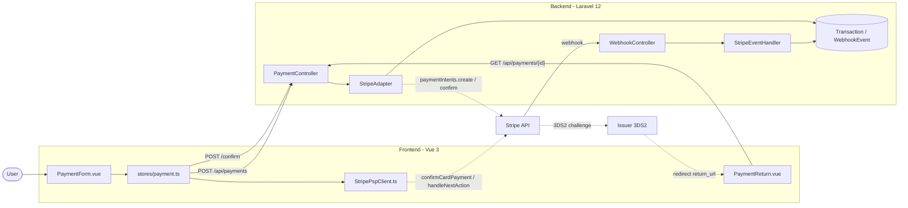
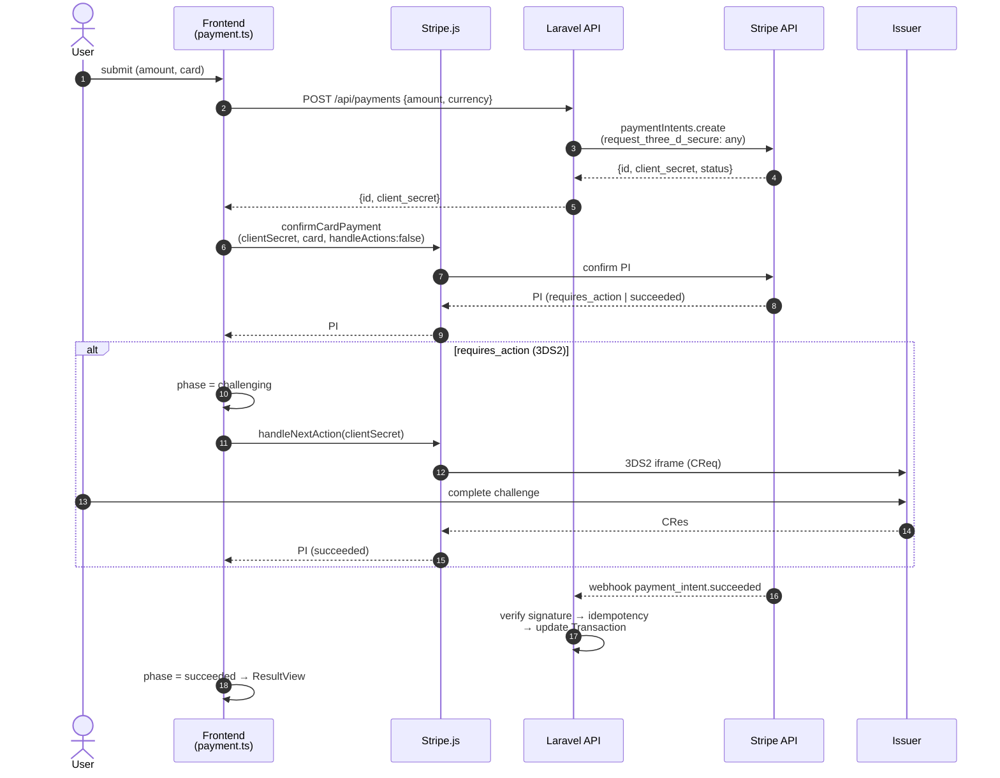
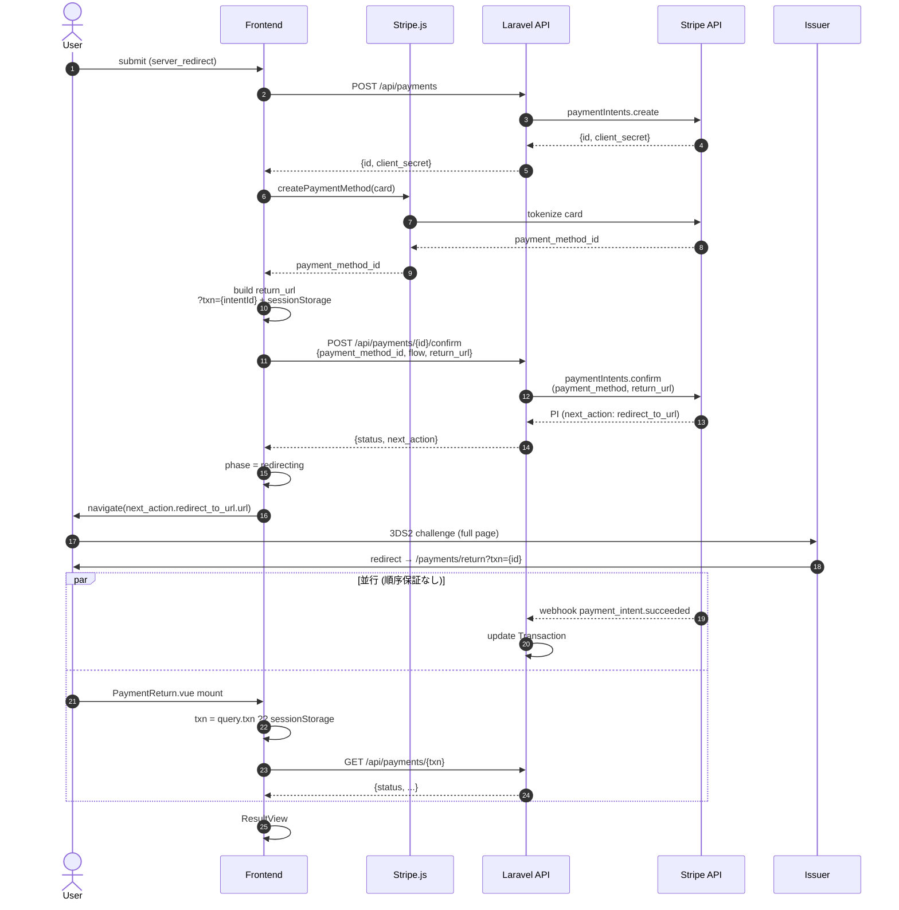
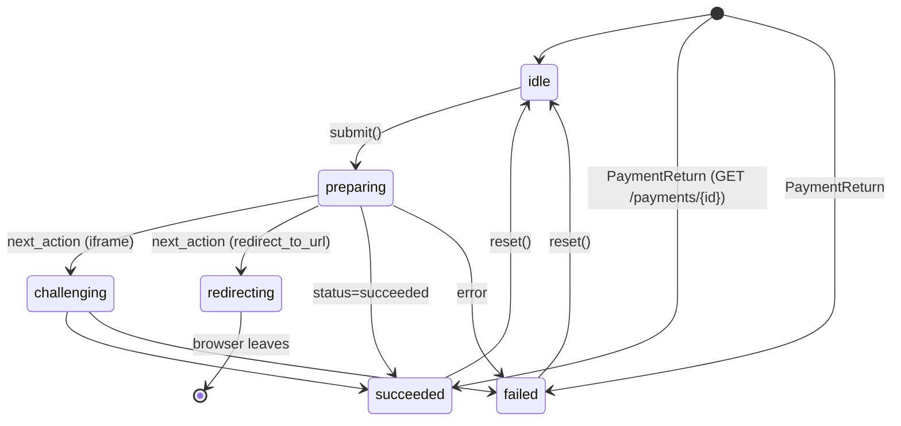

# 決済フロー データフロー

3DS2 決済フローを Mermaid 図で示す。Client SDK flow（iframe challenge）と Server Redirect flow（full-page redirect）の 2 系統。

## 全体構成図

## Flow A: Client SDK Flow (frictionless / iframe challenge)

## Flow B: Server Redirect Flow (full-page 3DS2)

## State Machine (frontend `phase`)

## 主要 file:line リファレンス

- [frontend/src/stores/payment.ts](../frontend/src/stores/payment.ts) — `start()`:63, `runClientSdkFlow()`:95, `runServerRedirectFlow()`:122
- [frontend/src/services/StripePspClient.ts:96](../frontend/src/services/StripePspClient.ts#L96) — `confirmCardPayment` + `handleNextAction`
- [frontend/src/views/PaymentReturn.vue:17](../frontend/src/views/PaymentReturn.vue#L17) — return URL ハンドラ
- [backend-laravel/app/Http/Controllers/Api/PaymentController.php:35](../backend-laravel/app/Http/Controllers/Api/PaymentController.php#L35) — create / confirm / show
- [backend-laravel/app/Adapters/StripeAdapter.php:49](../backend-laravel/app/Adapters/StripeAdapter.php#L49) — `paymentIntents.create`（`request_three_d_secure: 'any'`）
- [backend-laravel/app/Adapters/StripeAdapter.php:107](../backend-laravel/app/Adapters/StripeAdapter.php#L107) — `paymentIntents.confirm`
- [backend-laravel/app/Http/Controllers/Api/WebhookController.php:45](../backend-laravel/app/Http/Controllers/Api/WebhookController.php#L45) — 署名検証 + idempotency
- [backend-laravel/app/Services/StripeEventHandler.php:47](../backend-laravel/app/Services/StripeEventHandler.php#L47) — Transaction 状態同期

## 設計ポイント

- **Client SDK flow**: Stripe.js が status を直接返すため、webhook と UI 確定が独立しても race にならない。
- **Server Redirect flow**: return から戻った時点で webhook が先着している保証がないため、`GET /api/payments/{id}` でサーバ側の最新状態を取りに行く。
- **txn 受け渡し戦略**: `?txn={id}` (Strategy C) + sessionStorage (Strategy B) の二重化で、issuer が query を落とすケースに備える。
